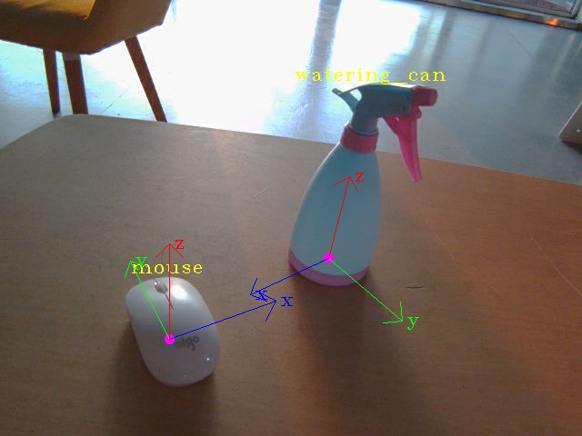
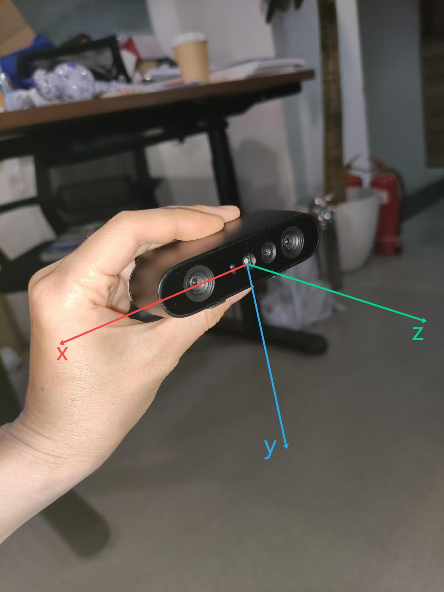

# 6D object pose estimation

## 须知
   
估计置于桌子上物体的位姿，故需将物体放置在桌子上采集图像，由于深度相机的原因，桌子颜色不能为深色

## 准备

(1) cd src/rgbd_pkg/scripts/data/checkpoints

(2) 查看下载链接:cat download_ckpts.txt

(3) 下载模型文件到当前路径

## 说明

### 输入

对齐的彩色图、深度图

W: 640 pixel

H: 480 pixel

### 输出

topic: 'aimo/rgbd_obj_cls_pose'

返回：8个浮点数 [cls, x, y, z, a, b, c, d] / 物体

(1) cls: 物体的类别id
		0: 'apple', 1: 'orange', 2: 'banana', 3: 'mouse', 4: 'brush', 5: 'box', 6: 'pringles', 7: 'watering_can'

(2) x, y, z: 表示物体的position, 在相机坐标系下的3d坐标(unit m)

(3) a, b, c, d: 物体本地坐标系local到相机坐标系cam下的旋转矩阵R_local2cam的四元数表示

目前仅支持其中4个物体：apple(苹果)、orange(橙子)、mouse(鼠标)、watering_can(喷壶)

(1) apple和orange

	可近似为半径为4cm的球, 所以仅有position, 没有pose

	position：形心

	pose    ：在输出中用0占位，即a=b=c=d=0.0

(2) mouse和watering_can

	position：底面中心，也是物体本地坐标系的原点

	pose    ：四元数，其本地坐标系的定义如下图

	
(3) 未检测到支持的物体：

	输出[-1., 0., 0., 0., 0., 0., 0., 0.]
					  
### 相机坐标系定义

如下图
	  

## 开始

(1) 连接奥比中光rgbd相机到nx

(2) 启动roscore

(3) 启动服务

./start_rgbd_cam_server.sh

(4) 启动节点

./start_rgbd_cam_node.sh
   

## 注意事项

相机的内参即采用奥比中光官方给的数据，且未去畸变，如果出现精度不够的情况可以找我标定相机
